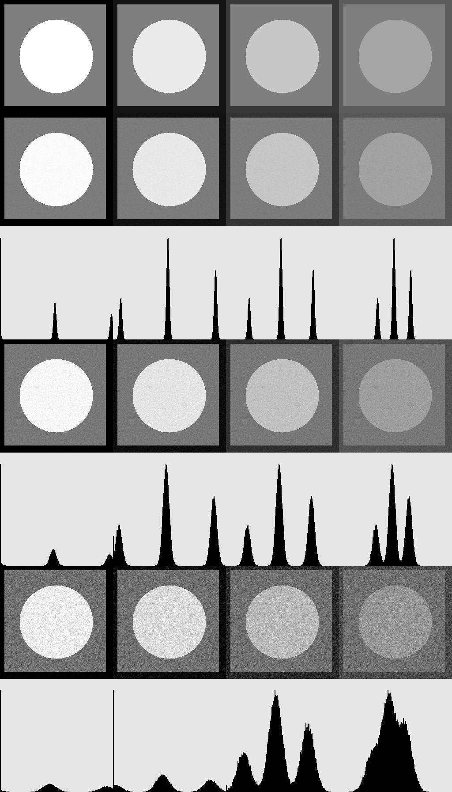

###Лабораторная работа 02: Шум изображения и гистограммы

В этой лабораторной работе мы изучим влияние шума изображения на качество изображения и как визуализировать распределения интенсивностей изображения с помощью гистограмм.

Шум изображения
Шум изображения - это случайные колебания яркости и цвета изображения, которые могут ухудшать качество изображения. Он может быть вызван различными факторами, включая низкие условия освещения, высокие значения ISO и шум датчика.

В этой лабораторной работе мы добавим гауссовский шум к изображению и наблюдать за его влиянием на качество изображения и распределение интенсивности.

Функции
В этом коде предоставлены следующие функции:

makeImage(int l1, int l2, int l3)
Эта функция создает тестовое изображение размером 256x256 с тремя уровнями интенсивности, заданными параметрами l1, l2 и l3. Фон изображения имеет интенсивность l1, прямоугольник размером 220x220 в центре изображения имеет интенсивность l2, а круг радиусом 83 в центре изображения имеет интенсивность l3.

drawHistogram(const cv::Mat& image)
Эта функция создает гистограмму для заданного изображения image. Гистограмма представляет собой изображение размером 256x256, где каждый столбец соответствует одному значению интенсивности в диапазоне от 0 до 255. Высота каждого столбца пропорциональна количеству пикселей в изображении с соответствующим значением интенсивности.

addNoise(const cv::Mat& image, double msq)
Эта функция добавляет гауссовский шум к заданному изображению image с средним msq. Шум генерируется с помощью стандартного генератора случайных чисел и нормального распределения. Значения пикселей изображения обновляются с учетом шума, и результат возвращается в виде нового изображения.

main(int argc, char** argv)
Эта функция является основной точкой входа в программу. Она создает тестовое изображение с четырьмя наборами уровней интенсивности, добавляет гауссовский шум к каждому изображению с тремя различными значениями среднего, создает гистограммы для каждого изображения с шумом и отображает все результаты в одном окне.

