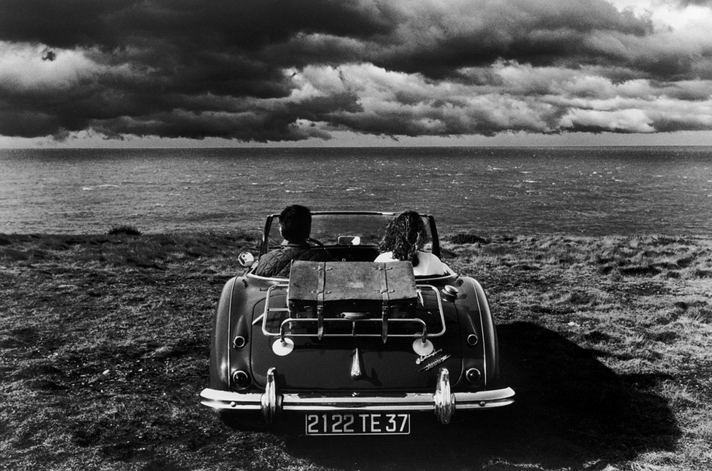
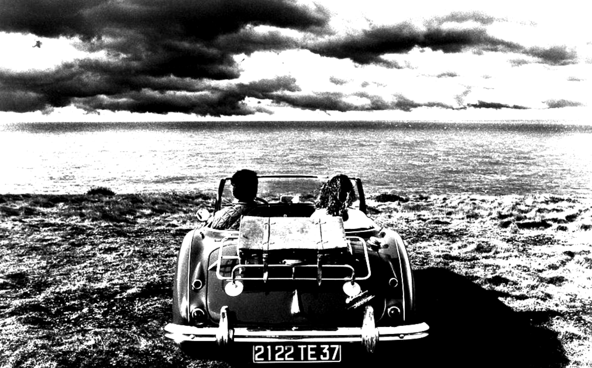
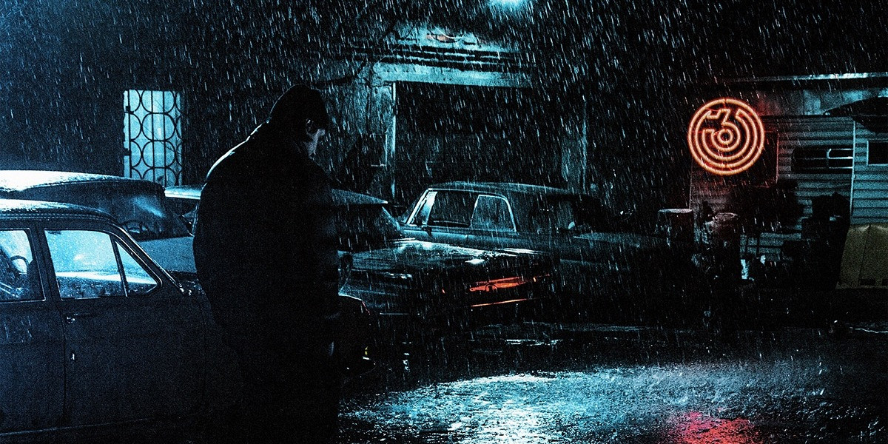
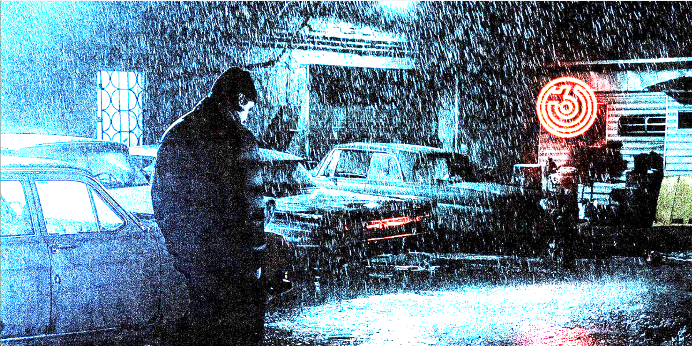

# Lab 03

## Ход работы

1. На вход поступает путь изображения, значения квантелей
и способ контрастирования цветного изображения
2. Проверяется тип изображения (одноканальное/цветное) методом
checkType, который сравнивает значения пикселей в трех каналах
и в случае равенства определяет изображение как одноканальное
3. В зависимости от типа изображения вызывается cv::Mat метод.
На вход аргументы: изображение, в случае цветного - тип обработки.
4. В обоих сценариях вызывается метод getBorders с параметром cv::Mat
который определяет границы контрастирования в зависимости от квантилей
5. Вызывается метод getContrastedSingleChannelImage/addContrastByBorders
в котором контрастируется и возвращается обработангое изображение

## Флаги

path - путь до изображения
firstQuantile - левый квантиль (ст. значение 0.0)
secondQuantile - правый квантиль (ст. значение 1.0)
combined - тип обработки цветного изображения (ст. значение 0)

## Пример использования

### Оригинальное изображение (1)



Пример использования (1)

```
make && ./../bin/lab03 -path=../prj.lab/lab03/test.jpeg -firstQuantile=0.2 -secondQuantile=0.7
```



### Оригинальное изображение (2)



Пример использования (2)

```
make && ./../bin/lab03 -path=../prj.lab/lab03/image.jpeg -firstQuantile=0.2 -secondQuantile=0.7
```

