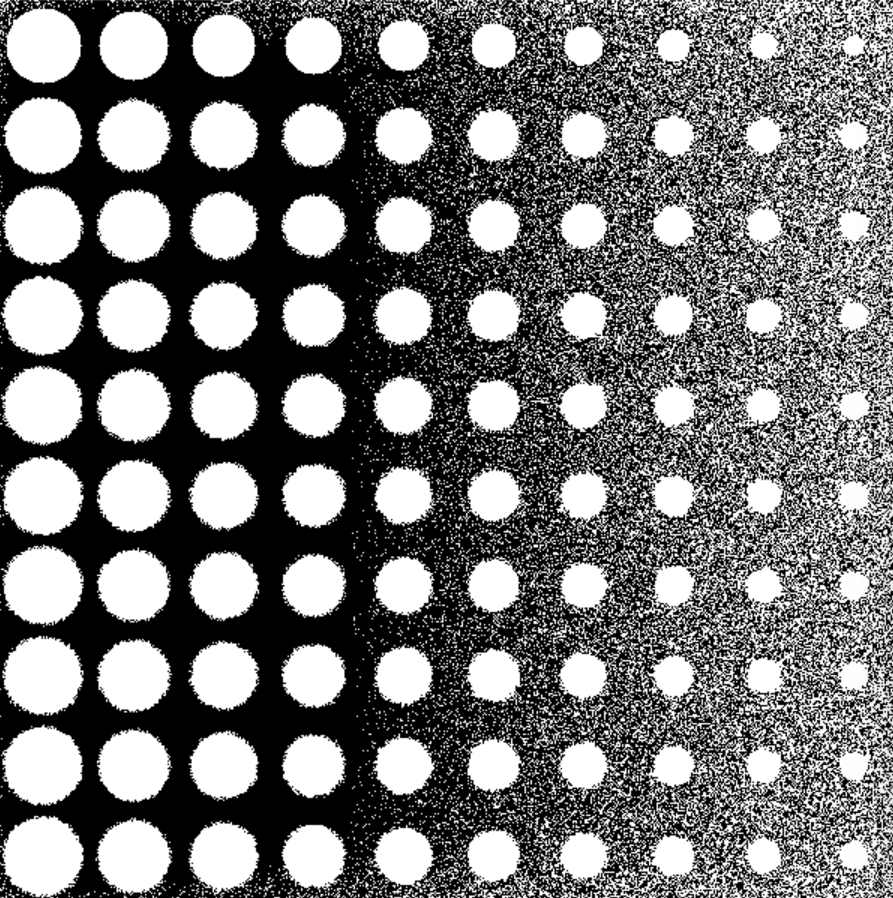
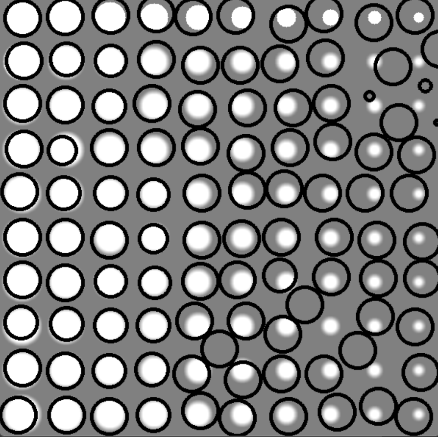

###Лабораторная работа 06: Обнаружение кругов и адаптивный порог
В этой лабораторной работе мы изучим применение преобразования Хафа для обнаружения кругов и адаптивного порога для бинаризации изображения.

Преобразование Хафа
Преобразование Хафа - это популярная техника компьютерного зрения для обнаружения кругов на изображении. Оно работает путем преобразования изображения из декартовой системы координат в пространство Хафа, где каждая точка на изображении соответствует кругу в пространстве Хафа. Затем алгоритм ищет локальные максимумы в пространстве Хафа, которые соответствуют центрам кругов на изображении.

Адаптивный порог
Адаптивный порог - это метод бинаризации изображения, который использует различные пороги для разных областей изображения. Этот метод полезен, когда освещение изображения неравномерно, и один глобальный порог не может эффективно разделить объекты от фона.

В этой лабораторной работе мы будем использовать адаптивный порог на основе среднего (mean) и стандартного отклонения (standard deviation) для бинаризации изображения. Конкретно, мы будем вычислять среднее и стандартное отклонение для каждого пикселя в окне размером blocksize x blocksize вокруг него. Затем мы будем применять порог, основанный на этих значениях, для преобразования пикселя в бинарное значение.

Код
В этом коде предоставлена функция detection, которая принимает бинарное изображение start и пустое изображение end для рисования обнаруженных кругов. Функция использует преобразование Хафа для обнаружения кругов на изображении start и рисует их на изображении end.

В основной функции main создается изображение total размером 600 x 600, состоящее из 100 кругов разного размера и интенсивности. Затем применяется адаптивный порог с окном размера blocksize x blocksize для бинаризации изображения. Полученное бинарное изображение передается в функцию detection для обнаружения кругов.

В конце изображение result сохраняется в файл "result.jpg".

