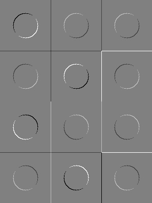

###Лабораторная работа №5
Эта лабораторная работа посвящена обработке изображений с использованием библиотеки OpenCV. В ней реализовано приложение, которое создает изображение, содержащее несколько объектов, и затем применяет к нему фильтр.

Описание кода
Код состоит из нескольких функций:

addlayer - функция, добавляющая слой на изображение. Принимает в качестве аргументов номер строки, изображение, номер объекта и номер цвета.
addObjects - функция, добавляющая все объекты на изображение.
mergeResults - функция, объединяющая результаты обработки изображения.
getFilteredImg - функция, применяющая фильтр к изображению. Принимает в качестве аргументов изображение и номер варианта фильтра.
В функции main создается изображение, добавляются на него объекты, применяется фильтр и сохраняется результат.

