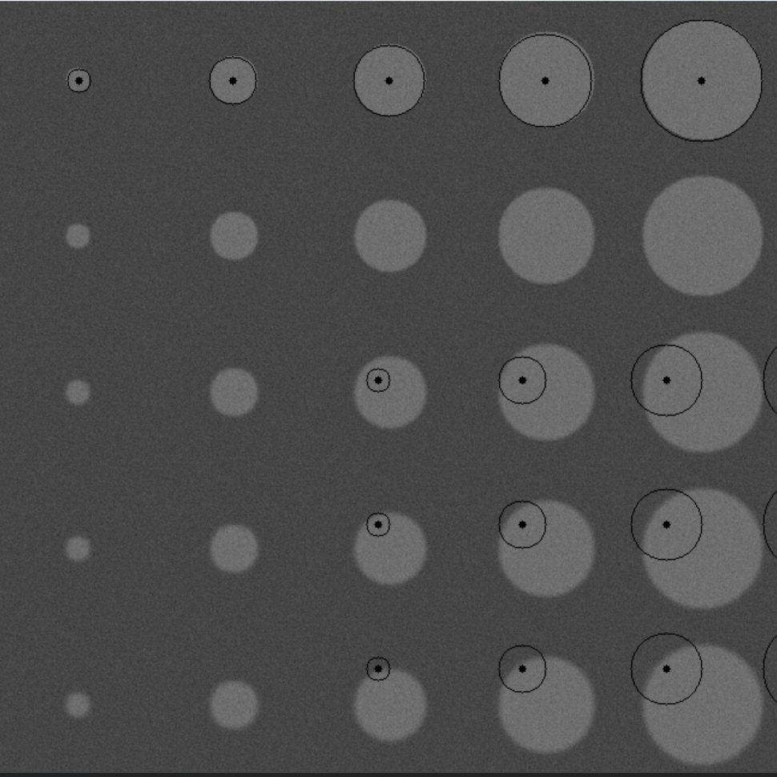

###Лабораторная работа №6
Этот файл содержит код на C++, который использует библиотеку OpenCV для обработки изображений. Код реализует следующие функции:

добавление шума к изображению;
обнаружение кругов на изображении;
адаптивный порог бинаризации;
анализ обнаруженных кругов и вычисление метрик FROC (sensitivity и false alarm rate).
Функции
add_noise
Функция добавляет шум к изображению. Шум генерируется с помощью нормального распределения с нулевым средним и заданной величиной шума.

detect_circles
Функция обнаруживает круги на изображении с помощью метода Хафа. Возвращает вектор из найденных кругов.

generated_images
Функция генерирует два изображения: исходное и бинарное. Исходное изображение содержит круги различных радиусов и степени размытия. Бинарное изображение получается из исходного с помощью адаптивного порога бинаризации.

detect_circles_with_analysis
Функция обнаруживает круги на изображении и проводит их анализ. Возвращает вектор из обнаруженных кругов, содержащий информацию о координатах центра, радиусе и том, является ли обнаруженный круг истинно-положительным.

draw_detections
Функция рисует обнаруженные круги на изображении. Истинно-положительные круги выделены зеленым цветом, ложно-положительные - красным.

draw_ground_truth
Функция рисует истинные круги на изображении.

calculate_froc_metrics
Функция вычисляет метрики FROC (sensitivity и false alarm rate) на основе обнаруженных кругов.

