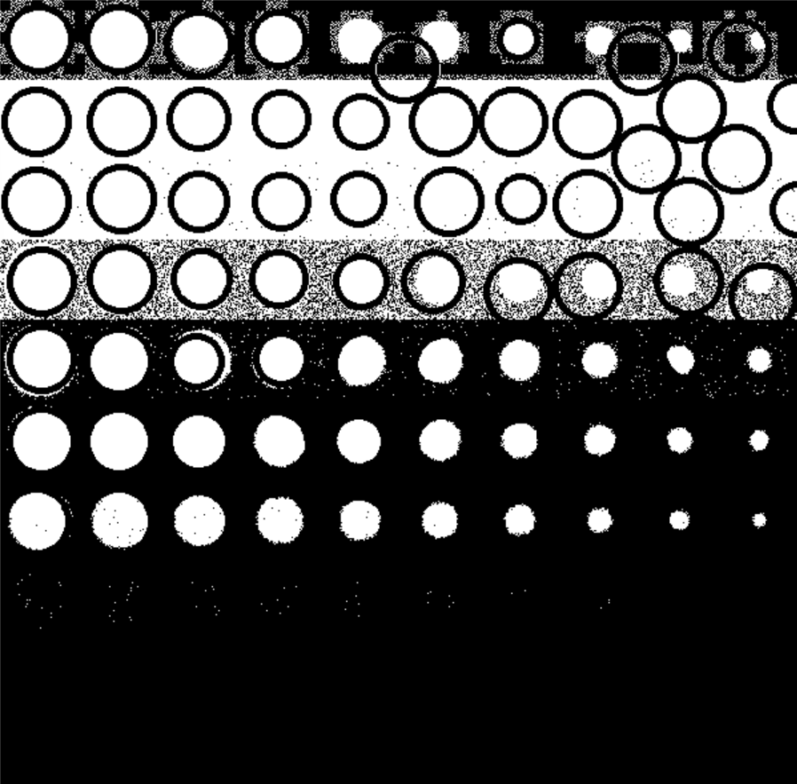
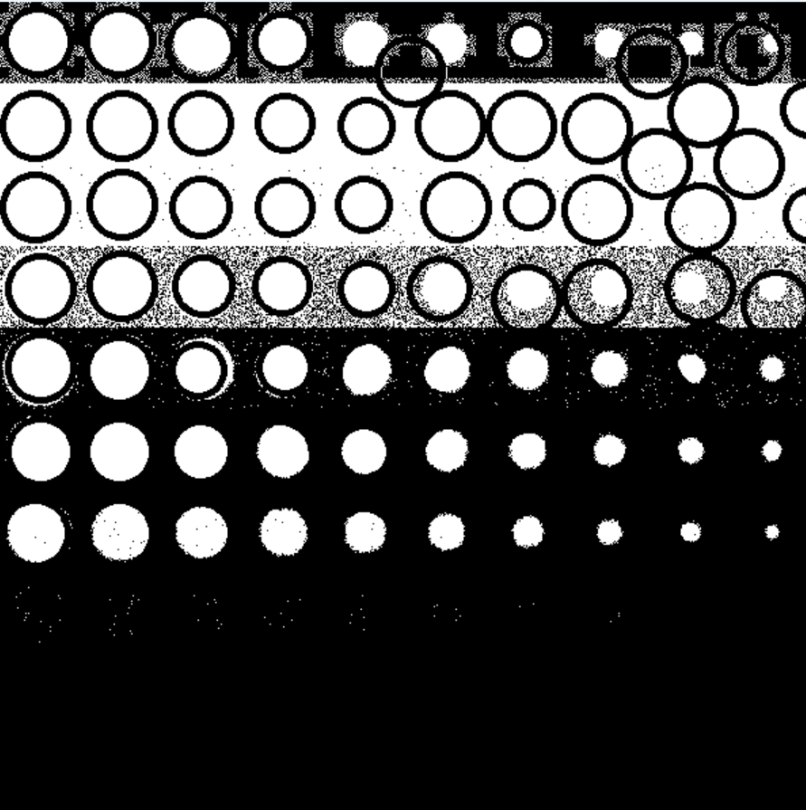

###Лабораторная работа №7

Функция segmentImage принимает в качестве аргумента исходное изображение src и выполняет его сегментацию. Сначала изображение конвертируется в оттенки серого, а затем применяется бинарный порог для разделения объектов на переднем плане и фона.

Функция calculateIoU принимает два бинарных изображения: сегментированное изображение segmented и ссылочное изображение reference. Она вычисляет IoU, которая является отношением площади пересечения двух изображений к площади их объединения.

В основной функции main загружается исходное изображение src и ссылочное изображение reference. Затем вызывается функция segmentImage для сегментации исходного изображения. Вычисляется IoU между сегментированным изображением и ссылочным изображением с помощью функции calculateIoU. Результат выводится на консоль.

