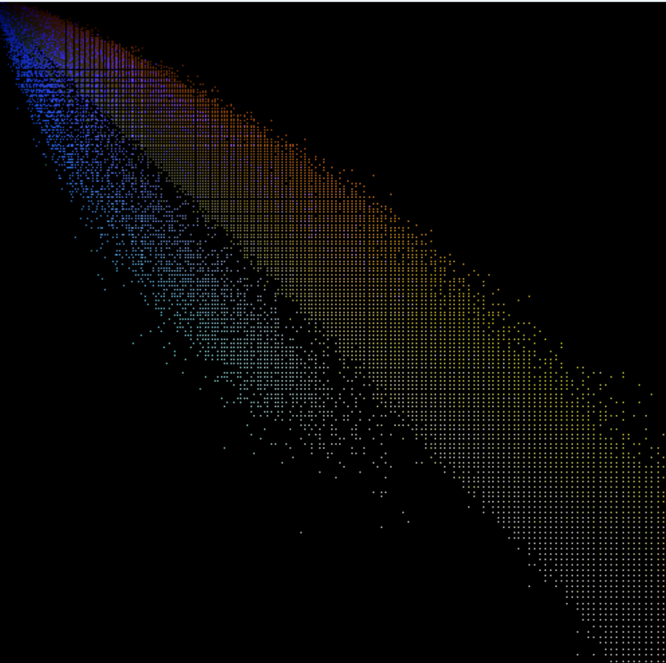

###Лабораторная работа №8

Этот код преобразует изображение из sRGB в линейное RGB и строит 3D рассеивающую диаграмму (scatter plot) пикселей изображения.

Функции
sRGBtoLinearRGB(const Vec3b& sRGB) - преобразует цвет пикселя из sRGB в линейное RGB.
draw3DScatterPlot(const vector<Vec3f>& points) - строит 3D рассеивающую диаграмму пикселей изображения.
Основной код
Загружается изображение с помощью imread().
Создается вектор linRGBPoints, содержащий все пиксели изображения в линейном RGB.
Вызывается функция draw3DScatterPlot(), которая строит 3D рассеивающую диаграмму пикселей изображения.
Пояснения к коду
sRGBtoLinearRGB() преобразует цвет пикселя из sRGB в линейное RGB. Для каждого канала (R, G, B) выполняется следующее преобразование:

linRGB[i] = (channel <= 0.04045) ? (channel / 12.92) : (pow((channel + 0.055) / 1.055, 2.4));
где channel - значение канала в sRGB, linRGB[i] - значение канала в линейном RGB.

draw3DScatterPlot() строит 3D рассеивающую диаграмму пикселей изображения. Для каждого пикселя выполняется следующее:

int x = static_cast<int>(point[0] * size);
int y = static_cast<int>(point[1] * size);
int z = static_cast<int>(point[2] * size);

if (x >= 0 && x < size && y >= 0 && y < size && z >= 0 && z < size) {
    plot.at<Vec3b>(y, x)[0] = saturate_cast<uchar>(z);
    plot.at<Vec3b>(y, x)[1] = saturate_cast<uchar>(y);
    plot.at<Vec3b>(y, x)[2] = saturate_cast<uchar>(x);
}
где point - точка в линейном RGB, size - размер изображения, plot - изображение с 3D рассеивающей диаграммой.

