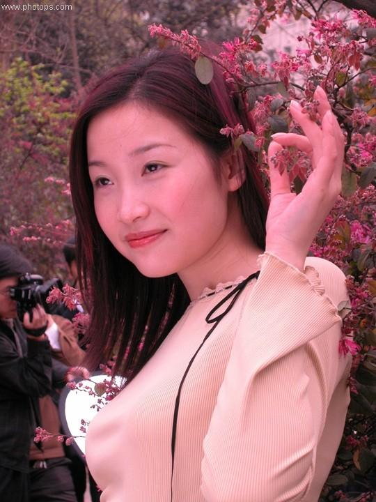
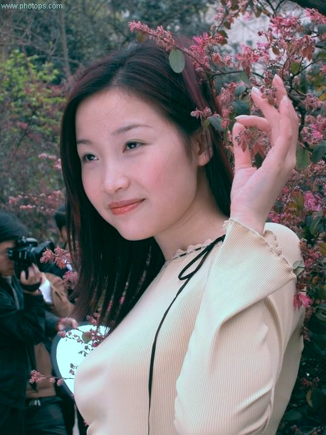

###Лабораторная работа №9
Этот код выполняет цветовую коррекцию изображения с помощью пространства цветов Lab.

Сначала изображение загружается с помощью функции cv::imread(). Затем пространство цветов изображения преобразуется из BGR в Lab с помощью функции cv::cvtColor().

После преобразования изображение разделяется на три канала (L, a и b) с помощью функции cv::split(). Затем для каждого канала a и b вычисляется среднее значение с помощью функции cv::mean().

Далее каждый канал a и b вычитается из своего среднего значения и прибавляется 128, чтобы сместить значения в диапазон [0, 255].

После этого каналы объединяются обратно в изображение с помощью функции cv::merge(). Затем пространство цветов изображения преобразуется обратно в BGR с помощью функции cv::cvtColor().

	
